---

## 🏠 Hub de Controle IoT: Flask + ESP32 (Socket.IO)

Este projeto implementa um sistema de controle de dispositivos IoT em tempo real, utilizando **Flask** como servidor web/Hub de comunicação e um **ESP32** como o dispositivo de campo para acionamento de relés. A comunicação bidirecional e de baixa latência é garantida pelo **Socket.IO**.

## 🚀 Tecnologias Utilizadas

| Componente      | Linguagem/Plataforma | Dependências Chave             | Função Principal |
|------------------|----------------------|---------------------------------|------------------|
| **Hub/Backend**  | Python (Flask)       | ``Flask-SocketIO``, ``python-socketio`` | Servidor Web, gerenciamento de status (Online/Offline) e roteamento de comandos. |
| **Frontend/UI**  | JavaScript, HTML, CSS | ``Socket.IO Client``, Tailwind CSS  | Interface de usuário responsiva e envio/recebimento de comandos em tempo real. |
| **Dispositivo**  | C++ (Arduino)        | ``WiFiManager``, ``SocketIOClient``     | Conexão Wi-Fi portátil, recebimento de comandos e controle de GPIO (Relés). |


## 📐 Arquitetura do Sistema

O sistema opera em uma arquitetura centralizada onde o servidor Flask atua como um broker de mensagens em tempo real:

1. **Conexão:** O ESP32 utiliza a biblioteca `WiFiManager` para se conectar à rede. Em seguida, estabelece uma conexão persistente de **Socket.IO** com o Hub Flask.

2. **Status:** O Hub Flask monitora a conexão, exibindo o status (`Online`/`Offline`) na interface.

3. **Comando/Roteamento:** O usuário clica na UI; o navegador envia o comando (`web_command`) ao Flask, que o retransmite ao ESP32.

4. **Ação/Feedback:** O ESP32 aciona o relé. Opcionalmente, pode enviar uma confirmação de volta ao Flask.


## 📊 Fluxograma



## 🛠️ Configuração do Backend (Flask Hub)

### Pré-requisitos

+ Python 3.x
+ PIP (Gerenciador de Pacotes Python)
+ PlatformIO Core (CLI): Essencial para compilação e upload do firmware ESP32

### 1. Preparação do Ambiente
Clone o repositório e configure as dependências (Python e PlatformIO):

### Instalação
Crie um ambiente virtual e instale as dependências:

```
# 1. Clonar o repositório:
git clone <URL_DO_SEU_REPOSITÓRIO>
cd <nome-do-diretorio>

# 2. Criar e ativar o ambiente virtual:
python -m venv venv
# Ative: source venv/bin/activate (Linux/macOS) ou .\venv\Scripts\activate (Windows)

# 3. Instalar dependências Python do WebHub:
pip install -r ./dependencias/requirements.txt

# 4. Instalar o PlatformIO Core (CLI):
pip install platformio

```
💡 Dica: O arquivo requirements.txt contém todas as bibliotecas necessárias (como Flask, Flask-SocketIO, python-socketio, etc.), permitindo configurar o ambiente completo em um só comando.

### 2. Execução do Backend (Hub Flask)

Com o ambiente virtual ativado, inicie o servidor Flask. O Hub estará disponível em `http://127.0.0.1:5000`
```
python app.py
```


## 💻 Configuração do Firmware (ESP32)

### Procedimento de Upload
1. Conecte o ESP32 ao seu PC via cabo Micro-USB.

2. O arquivo platformio.ini gerencia automaticamente a plataforma e as dependências C++.

3. Execute o comando de build e upload no terminal (dentro da pasta raiz do projeto):

```
pio run -t upload
```
**Ação do Comando:** Substitui a Arduino IDE, compilando o código C++ e gravando o binário na memória Flash do ESP32.

### Portabilidade Wi-Fi (WiFiManager)

Na **primeira execução**, o ESP32 cria um Ponto de Acesso (AP). Conecte-se a ele (`ESP32_HUB_SETUP`), configure o Wi-Fi e o Hub. O ESP32 salva as credenciais, reinicia e se conecta automaticamente.

| **Evento** | **Direção** | **Propósito** |
|----|----|----|
| ``connect`` | ESP32 -> Flask | Notifica o Hub que o dispositivo está online. |
| ``web_command`` | Flask -> ESP32 | Recebe o JSON de comando (``{"target": "lamp", "state": "on"}``). |
| ``status_update`` | ESP32 -> Flask | Opcional: Envia confirmação de que o comando foi executado. |

## Estrutura de Arquivos
```
├── Codigo_ESP32/Codigo_ESP32.ino    # Código C++ do Firmware (ESP32)
├── dependencias/
    └── platformio.ini # Configuração do build e dependências do ESP32
    └── requirements.txt # Lista de dependências Python
└── static/
    ├── js/main.js          # Lógica do Socket.IO e UI do cliente  
    ├── img/fluxograma.svg  # Fluxograma deste projeto
    └── css/styles.css      # Estilos customizados
└── templates/
    ├── index.html      # Frontend HTML
    └── login.html      # Tela de Login    
├── app.py              # Aplicação Flask principal e lógica Socket.IO
└── README.md           # Este arquivo
```

